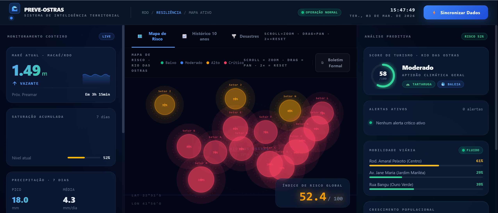

<div align="center">

# 🌊 PREVE-OSTRAS
### Sistema de Inteligência Territorial para Resiliência Urbana

**Análise preditiva em tempo quase real · Rio das Ostras / RJ**

[](https://preve-ostras.web.app)
[](https://www.typescriptlang.org)
[](https://react.dev)
[](https://python.org)
[](https://d3js.org)
[](https://vite.dev)
[](LICENSE)

<br/>

> **"Da maré astronômica ao índice de risco — tudo em uma tela."**

<br/>

**[🌐 Acessar Demo ao Vivo →](https://preve-ostras.web.app)**

</div>

---

## 📸 Interface



> Dashboard Full HD (1920×1080) com mapa tático de 15 setores, heatmap interativo, monitoramento de maré em tempo real e índice de risco global.

---

## 📌 O que é o Preve-Ostras?

O **Preve-Ostras** é uma plataforma de **análise territorial preditiva** desenvolvida para o município de Rio das Ostras (RJ). Ela cruza dados de **maré astronômica**, **precipitação acumulada**, **densidade demográfica** e **topografia** para gerar, em tempo quase real, dois indicadores estratégicos:

| Indicador | Descrição |
|:---|:---|
| 🔴 **Índice de Risco de Resiliência Urbana** (0–100) | Risco consolidado por setor geográfico, com heatmap interativo |
| 🌿 **Score Preditivo de Turismo** (0–100) | Aptidão climática e operacional para atividades turísticas |

A ferramenta é concebida como **apoio à decisão** para gestores de defesa civil, planejamento urbano e turismo — não substitui protocolos oficiais.

---

## ✨ Funcionalidades

| Módulo | Detalhe |
|:---|:---|
| 🗺️ **Mapa Tático de Risco** | 15 setores georreferenciados com heatmap D3.js (zoom · pan · tooltip) |
| 🌊 **Monitor de Maré** | Altura, tendência e previsão de preamar em tempo real |
| 📊 **Saturação Acumulada** | Histórico de 7 dias com modelo de decaimento exponencial (80%) |
| 📈 **Crescimento Populacional** | Série histórica IBGE SIDRA com tendência e variação percentual |
| ⚡ **Alertas Preditivos** | Geração automática por nível (baixo / médio / alto / crítico) |
| 🚗 **Mobilidade Viária** | Status das vias principais por impacto de precipitação acumulada |
| 🏥 **Risco Epidemiológico** | Índice baseado em saturação e adensamento urbano |
| 📋 **Boletim Formal** | Relatório exportável em PDF com ID único e métricas técnicas |
| 🐢 **Score de Turismo** | Gauge circular com aptidão geral e ícones temáticos (tartaruga · baleia) |

---

## 🏗️ Arquitetura

```
┌──────────────────────── BROWSER ────────────────────────┐
│                                                          │
│  React 19 + TypeScript + Vite + D3.js + Tailwind v4     │
│                                                          │
│  ┌─────────────┐  ┌────────────────────┐  ┌──────────┐  │
│  │ SidebarLeft │  │  ResilienceMap(D3) │  │Sidebar   │  │
│  │ Maré        │  │  15 Setores        │  │Right     │  │
│  │ Saturação   │  │  Zoom/Pan/Glow     │  │Turismo   │  │
│  │ Saúde/Infra │  │  Heatmap Dinâmico  │  │Alertas   │  │
│  └─────────────┘  └────────────────────┘  └──────────┘  │
│                                                          │
│       fetch() direto              writeBatch()           │
└──────────────┬───────────────────────────┬───────────────┘
               ▼                           ▼
   ┌─────────────────────┐     ┌─────────────────────────┐
   │   APIs Públicas     │     │  Firebase (Spark)        │
   │  🏛️ IBGE SIDRA      │     │  Firestore               │
   │  🌦️ Open-Meteo      │     │  Hosting · CDN Global    │
   └─────────────────────┘     └─────────────────────────┘
```

> **Sem Cloud Functions necessárias.** Ambas as APIs são CORS-habilitadas — o browser faz fetch direto. O Firestore atua como cache persistente. Plano **Spark (gratuito)** é suficiente.

---

## 🔬 Modelo de Análise de Resiliência

O núcleo da plataforma implementa um modelo quantitativo com três eixos:

### 1 · Saturação Acumulada do Solo
```
sat[i] = sat[i-1] × 0.80 + precipitacao[i]
risco_acumulado = min(100, (sat / 50) × 100)
```
Decaimento exponencial de 20%/dia simula a capacidade de absorção e drenagem.

### 2 · Multiplicador Demográfico
```
pop_multiplier = 1.25  # município em crescimento acelerado
pop_multiplier = 1.00  # estável
```

### 3 · Fator de Maré (setores costeiros C, G, M, N, O)
```
tide_factor = 1.30  # maré > 1.2m em zona costeira (obstrui canais pluviais)
tide_factor = 1.00  # demais condições
```

### Risco Final por Setor
```
risco_setor = min(100, sat_acumulada/40 × 100 × topo_factor × pop_mult × tide_factor)
```

---

## 🗺️ Setores Monitorados

| Setor | Bairros | Fator de Risco Primário |
|:---:|:---|:---|
| A | Bosque / Recanto | Adensamento |
| B | Operário / Casa Grande | Adensamento |
| C | Centro / Boca da Barra | ⚠️ Topografia Crítica + Maré |
| D | Nova Esperança | Topografia Crítica |
| E | Nova Cidade / Village | Topografia Crítica |
| F | Jardim Mariléa | Adensamento |
| G | Costazul / Colinas | Influência de Maré |
| H | Âncora / Village | Monitoramento |
| I | Rocha Leão | Monitoramento |
| J | Cantagalo | Monitoramento |
| K | Serramar / Palmital | Adensamento |
| L | Mar do Norte | Monitoramento |
| M | Costa Praiana / Beira Mar | ⚠️ Topografia Crítica + Maré |
| N | Ouro Verde / Recreio | 🔴 **Topografia Crítica (maior risco)** |
| O | Enseada / Terra Firme | Influência de Maré |

---

## 🌐 Fontes de Dados

| Fonte | Dado | Atualização | Cache |
|:---|:---|:---:|:---|
| **IBGE SIDRA** · Tab. 6579 | População estimada 2001–atual | Anual | `ibge_populacao/{ano}` |
| **Open-Meteo** | Temp., precipitação, vento (30 dias) | Diária | `clima_historico/{data}` |
| **Maré simulada** | Modelo semi-diurno (ciclo 12.42h) | Contínua | Calculado localmente |

> Todas as APIs são **gratuitas, abertas e sem necessidade de chave de autenticação**.

---

## 🛠️ Stack Técnica

**Frontend**

| Tecnologia | Versão | Papel |
|:---|:---:|:---|
| React | 19 | Framework de UI |
| TypeScript | 5.x | Tipagem estática estrita |
| Vite | 7.x | Build tool + HMR |
| D3.js | 7.x | Mapa tático e visualizações |
| Tailwind CSS | v4 | Design system utilitário |

**Backend / Infra**

| Tecnologia | Papel |
|:---|:---|
| Firebase Hosting | CDN global para o SPA |
| Cloud Firestore | Cache persistente de dados abertos |
| Python 3.11 | Cloud Functions (roadmap) |
| Pandas 2.2 | Processamento de dados no backend |

---

## 🚀 Rodando Localmente

### Pré-requisitos
- Node.js ≥ 18
- Firebase CLI → `npm install -g firebase-tools`
- Java ≥ 11 (para emulador do Firestore)
- Python ≥ 3.11 *(opcional — apenas Cloud Functions futuras)*

### Instalação

```bash
# 1. Clonar o repositório
git clone https://github.com/Rilen/preve-ostras.git
cd preve-ostras

# 2. Instalar dependências
npm install

# 3. Configurar variáveis de ambiente
cp .env.example .env
# Edite .env com as suas credenciais Firebase (opcional para dev local)

# 4. Iniciar emulador do Firestore (terminal separado)
firebase emulators:start --only firestore

# 5. Iniciar servidor de desenvolvimento
npm run dev
```

Acesse **http://localhost:5173**

### Scripts

| Comando | Descrição |
|:---|:---|
| `npm run dev` | Servidor de desenvolvimento com HMR |
| `npm run build` | Bundle de produção otimizado |
| `npm run preview` | Pré-visualização do build local |
| `npx tsc --noEmit` | Verificação de tipos TypeScript |
| `firebase emulators:start` | Emuladores locais do Firebase |

---

## ☁️ Deploy

```bash
# Build de produção
npm run build

# Deploy completo (Hosting + Firestore Rules)
firebase deploy

# Deploy parcial
firebase deploy --only hosting
firebase deploy --only firestore:rules
```

| Serviço | URL |
|:---|:---|
| 🌐 Aplicação | https://preve-ostras.web.app |
| 🖥️ Console Firebase | https://console.firebase.google.com/project/preve-ostras |

---

## 🔐 Segurança do Firestore

As regras em `firestore.rules` permitem leitura/escrita pública **apenas nas coleções de dados governamentais abertos** (`ibge_populacao`, `clima_historico`). Todas as demais coleções são bloqueadas por padrão.

> Versão futura com Firebase Auth restringirá a escrita a usuários autenticados.

---

## 🔮 Roadmap

- [ ] Autenticação via **Firebase Auth**
- [ ] Integração com dados reais de maré da **Marinha do Brasil (DIMH)**
- [ ] **Notificações push** via Firebase Cloud Messaging ao cruzar limiares
- [ ] **Histórico de alertas** com timeline de eventos
- [ ] Export em **GeoJSON** para integração com ArcGIS / QGIS
- [ ] **API REST** interna via Cloud Functions (plano Blaze)
- [ ] Comparativo histórico entre eventos de precipitação

---

## 👤 Autor

**Rilen Tavares Lima**  
Data Scientist · Supervisor de Governança de TIC · 25+ anos em infraestrutura crítica

[](https://www.linkedin.com/in/rilen/)
[](https://github.com/rilen)
[](https://rilen.github.io/portfolio/)

---

<div align="center">

**Preve-Ostras** · Rio das Ostras · RJ · Brasil

*Dados fornecidos por IBGE, Open-Meteo e Marinha do Brasil.*  
*Esta plataforma é uma ferramenta de apoio à decisão — não substitui protocolos oficiais de defesa civil.*

</div>
